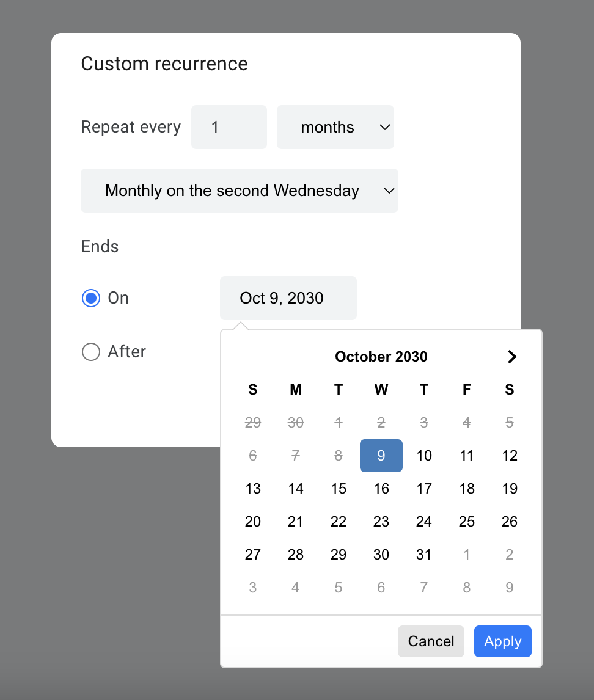

<a name="readme-top"></a>
<br />
<p align="center">
  
  <h3 align="center">Recurring Dates Form</h3>
</p>

## About the Project

The recurring dates form can be attached to any element to pop up a modal for selecting a recurrence schedule,
such as "Every 2 weeks on Tuesday and Thursday until Jan 18, 2024". The form allows for generations of recurring dates or 
recurring date ranges. 

The user interface is based on Google's Material Design and the Google Calendar recurrence selector.

## Dependencies

This component depends on jQuery, Moment.js, and Date Range Picker for UI behaviors, and RRule.js for generating the dates.

## Getting Started

To get started, include jQuery, Moment.js, Date Range Picker, RRule, and RDates files into your webpage:

```
<script src="https://cdn.jsdelivr.net/jquery/latest/jquery.min.js"></script>
<script src="https://cdn.jsdelivr.net/momentjs/latest/moment.min.js"></script>
<script src="https://cdn.jsdelivr.net/npm/daterangepicker/daterangepicker.min.js"></script>
<script src="https://cdn.jsdelivr.net/npm/rrule@2.7.2/dist/es5/rrule.min.js"></script>
<script src="rdates.js"></script>  // Modify this to the path where you downloaded the file.

<link rel="stylesheet" type="text/css" href="https://cdn.jsdelivr.net/npm/daterangepicker/daterangepicker.css" />
<link rel="stylesheet" href="./rdates.css">
```

Then attach a form to the element you want to trigger it:

```

$('#my-show-form-button').rdates();

```

By default, the form assumes the start date of the recurrence is <i>now</i>, but it can be customized with options.
If you are generating recurring date ranges, you can provide a custom start date and end date for the initial date range.

<hr>

You can retrieve the results of the recurrence in two ways.

By retrieving them directly from the component:
```
const rdates = $('#my-show-form-button').rdates();
...
const dates = rdates.results();
```
or by providing a callback for when the user clicks done:
```
$('#my-show-form-button').rdates({
  onDoneClick: (dates) => console.log(dates)
});
```

<hr>

If your dates are set dynamically, for example through user input, you can set the dates programatically:
```
const rdates = $('#my-show-form-button').rdates();
...
rdates.setStartDate(new Date());
```

## Examples
Generating recurring dates for a single date
```
const rdates = $('#my-show-modal-button').rdates({
  startDate: new Date('2023-10-10'),
  title: 'Set recurrence',
  onDoneClick: handleOnDoneClick,
  onCancelClick: handleOnCancelClick
});

const setStartDate = (date) => {
  rdates.setStartDate(date);
};

const setEndDate = (date) => {
  rdates.setEndDate(date);
};
```

Generating recurring date ranges
```
const rdates = $('#my-show-modal-button').rdates({
  startDate: new Date('2023-10-10'),
  endDate: new Date('2023-10-12'),
});

const printResults = () => {
  const results = rdates.results();

  console.log(results);
}
```
